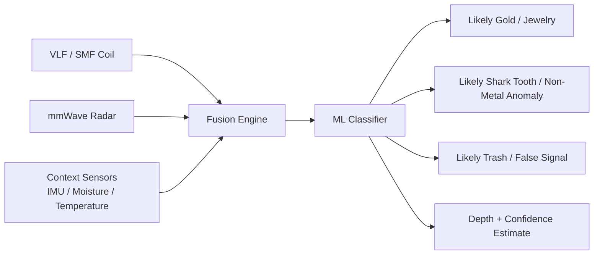
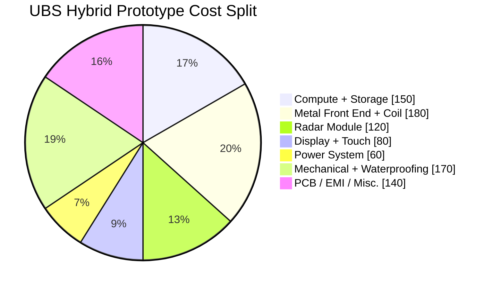
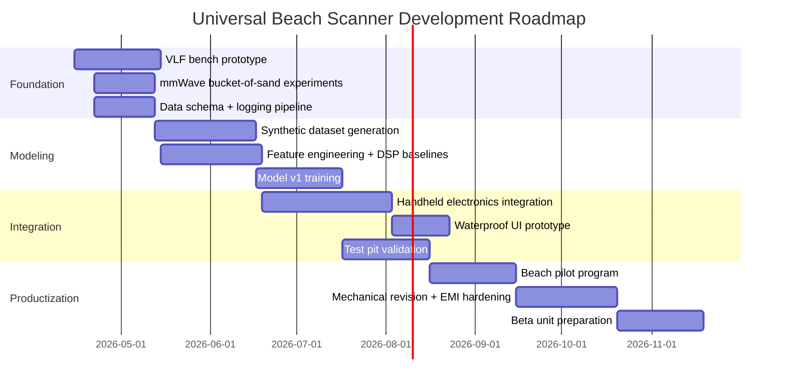

Imagine a detector that does more than beep when it sees conductive metal. Imagine a beach tool that can scan for rings, coins, chains, and rare metallic targets while also highlighting non-metallic anomalies near the surface—objects like shark teeth that ordinary hobby detectors simply cannot see. That is the core promise of the **Universal Beach Scanner (UBS)**: a sensor-fusion platform that blends electromagnetic induction, radar, and machine learning into a single beach-ready product.

The exciting part is that UBS is not just a bigger metal detector idea. It is really the beginning of a new category: a **consumer subsurface intelligence device**. The challenge is that beaches are among the hardest places to sense accurately. Dry sand, wet salt sand, black sand, shell fragments, buried trash, and constantly changing moisture profiles all distort the signal. So the real innovation is not just in sending waves into the ground. It is in how the system decides what those returns actually mean.

## 🌊 Why UBS Matters

Today’s best beach detectors are extremely good at finding conductive targets. They can separate coins from nails, reject some junk, and remain usable in wet salt environments. But they still operate inside the same basic physical framework: they are listening for how conductive objects respond to a transmitted electromagnetic field.

That creates a major opportunity. A gold ring and a pull-tab may both respond electromagnetically, but a shark tooth often will not. A fossil tooth is valuable, collectible, and common enough to attract a real beach-hunting audience, yet it remains effectively invisible to classic induction systems. UBS matters because it aims to unify **metal hunting** and **subsurface anomaly hunting** into one user experience.

In product terms, that means UBS could become attractive to several user groups at once:

- **Beach detectorists** hunting jewelry and coins
- **Shark tooth collectors** working dry or lightly wet sand
- **Research-minded hobbyists** who want tunable target profiles
- **Commercial users** who value data logging, heatmaps, and repeatable scans instead of guesswork

## 🔎 What Current High-End Detectors Already Do Well

The benchmark products in this category are not cheap toys. They are serious signal-processing platforms wrapped inside waterproof consumer hardware.

High-end detectors typically excel at five things:

1. **Simultaneous multi-frequency metal detection** for better target separation
2. **Ground balancing** to reduce mineral and salt effects
3. **Fast recovery speed** so adjacent targets can be separated
4. **Target ID systems** that estimate conductivity classes
5. **Beach modes** that help stabilize performance in salty environments

That means UBS should not try to replace top-end metal detection with something weaker. It should preserve those strengths and then extend the stack into **non-metal sensing** and **probabilistic target classification**.

## 📡 The Wave Stack: Which Signals Actually Make Sense for Sand?

The most important technical lesson for UBS is simple: **no single wave is best for everything**.

### 1. VLF / SMF Electromagnetic Induction
This is the foundation for rings, coins, jewelry, and most metallic targets.

A transmit coil emits an alternating magnetic field. When that field couples into a conductive object, it induces eddy currents. Those currents generate a return field, and the detector measures the amplitude and phase shift of that response. Different metals and target geometries produce different signatures, which is why modern detectors can estimate whether something is probably iron, foil, nickel, or a higher-conductive target.

**Best for:** rings, coins, chains, metallic relics, rare conductive targets  
**Weakness:** blind to non-conductive targets like teeth, bone, dry gemstones, or plastic objects

### 2. Lower-Frequency UWB / GPR-Style Radar
If UBS eventually wants to look deeper into sand for non-metallic anomalies, this is the family of sensing to research most seriously.

Ground-penetrating radar works by sending high-frequency electromagnetic pulses into the subsurface and detecting reflections that occur at boundaries where dielectric properties change. In dry sand, this can work surprisingly well. In wet or saline conditions, attenuation rises and performance drops. Lower frequencies penetrate deeper, while higher frequencies give better resolution but lose depth.

**Best for:** density and dielectric contrasts, buried layers, non-metallic anomalies  
**Weakness:** difficult to miniaturize well, harder in wet salt sand, challenging for very small targets

### 3. 60 GHz mmWave Radar
This is one of the most realistic near-term additions to a handheld product.

Modern 60 GHz radar modules are compact, affordable, and easy to interface with embedded compute. They offer high resolution at short range and can be useful for very shallow anomaly detection. For UBS, that makes mmWave attractive for top-layer beach scanning, especially when paired with a metal detector coil and ML model.

**Best for:** shallow, high-resolution near-surface sensing in dry or lightly damp sand  
**Weakness:** not a replacement for deep GPR; depth is limited and moisture hurts performance

### 4. Thermal Imaging
Thermal is not a buried-object solution, but it can help for surface or near-surface anomaly spotting at dawn or dusk when heat-retention differences are strongest.

**Best for:** exposed or near-surface finds, UX experimentation  
**Weakness:** weak for buried-object detection, highly environment-dependent

### 5. Acoustic / Ultrasonic
This sounds appealing because sonar works so well in water, but beach sand is not water. Sand is a lossy, scattering medium for small-object acoustic detection. It is worth researching only for niche wet-slurry or edge-of-surf experiments, not as a first-product core sensor.

**Best for:** experimental edge cases  
**Weakness:** poor fit for dry sand treasure hunting

### 6. LiDAR and Terahertz
These are useful to understand mainly so time and money are not wasted.

LiDAR is excellent for surface mapping but not for buried targets in sand. Terahertz can produce extraordinary material contrast in controlled environments, but it is currently too moisture-sensitive and too expensive for a rugged consumer beach tool.

## 🧠 The Real Breakthrough: Sensor Fusion, Not a Single Sensor

UBS becomes special when its sensors stop acting like separate gadgets and start behaving like one inference engine.

A good UBS device would not simply ask, “Is there metal here?” It would ask:

- Is the signal conductive?
- Does radar also see a local density or dielectric discontinuity?
- Is the target shallow or deep?
- Is the sand dry, wet, mineralized, or shell-heavy?
- Does this pattern match gold, trash, shell, or tooth-like examples in the training set?

That is where machine learning earns its place. Not as magic, but as a practical way to combine weak clues into a stronger prediction.

## 🏖️ What UBS Could Detect Best

The honest answer is that UBS will not be equally good at every class of object on day one. The best product is one that clearly defines its strengths.

### Strongest near-term targets
- Gold and silver jewelry
- Coins and metallic relics
- Small conductive targets in beach sand
- Shallow non-metal anomalies in dry sand
- Shark teeth near the surface when radar contrast is sufficient

### Harder targets
- Tiny deep shark teeth
- Wet-sand non-metal targets near the surf line
- Gemstones without metal settings
- Precise elemental identification of “rare metals”
- Deep non-conductive objects in highly conductive salt environments

That means the smartest commercial positioning is not “find everything under the beach.” It is:

> **Find metals exceptionally well, and add a new class of shallow non-metal beach detection that no mainstream detector currently offers.**

That is still a major market advantage.

## ⚙️ The Best Way to Build UBS

The best version-one architecture is not a full deep-penetration geophysical instrument. It is a **hybrid, beach-optimized handheld system**:

1. **A strong metal-detection core** built around VLF or simultaneous multi-frequency induction
2. **A shallow high-resolution radar layer** using 60 GHz mmWave for non-metal anomaly cues
3. **On-device ML inference** for target classification and confidence scoring
4. **A bright touch display** for visual target presentation
5. **Data logging** so every confirmed find improves the model later

This approach gives you something real, manufacturable, and differentiated without pretending that a compact consumer unit will instantly replace a full GPR rig.

## 🛠️ Suggested Hardware Architectures

### Option A: UBS Lite — Metal-First Smart Detector
This is the fastest path to a working product.

| Subsystem | Suggested Approach | Estimated Prototype Cost |
| :--- | :--- | :--- |
| Compute | STM32 + optional SBC companion | $25 - $140 |
| Metal sensing | Custom VLF front end + search coil | $80 - $180 |
| Display | Small LCD / app-driven UI | $25 - $80 |
| Power | Li-ion pack + BMS | $30 - $70 |
| Mechanical | Shaft, enclosure, seals, connectors | $80 - $160 |
| Total | Metal-first intelligent detector | **$240 - $630** |

**Why build this first:** It proves your signal pipeline, UX philosophy, and target-profile logic before adding radar complexity.

### Option B: UBS Hybrid — Best Commercial Starting Point
This is the most compelling first real UBS product.

| Subsystem | Suggested Approach | Estimated Prototype Cost |
| :--- | :--- | :--- |
| Compute | Raspberry Pi 5 or similar SBC | $110 - $175 |
| Metal sensing | Custom VLF / SMF-inspired analog front end | $100 - $220 |
| Radar | 60 GHz mmWave development module | $50 - $180 |
| Display | 7-inch capacitive touch display | $60 - $120 |
| Power | Battery pack, charging, regulation | $40 - $90 |
| Mechanical | Waterproof housing, shaft, seals, mount | $120 - $250 |
| EMI / PCB / integration | Shielding, custom boards, harnesses | $100 - $250 |
| Total | Sensor-fusion prototype | **$580 - $1,285** |

**Why this is the sweet spot:** It is realistic, differentiated, and technically exciting without forcing deep-GPR hardware into a consumer wand too early.

### Option C: UBS Research — Deep Non-Metal Exploration
This is the ambitious path for a research lab or advanced prototype program.

| Subsystem | Suggested Approach | Estimated Prototype Cost |
| :--- | :--- | :--- |
| Compute | Jetson Orin Nano-class edge AI platform | $249 - $350 |
| Metal sensing | Advanced VLF / SMF front end | $120 - $250 |
| Radar layer 1 | 60 GHz mmWave | $50 - $180 |
| Radar layer 2 | Experimental lower-frequency GPR / UWB front end | $500 - $2,000+ |
| Display / logging | Sunlight-readable touch UI + storage | $100 - $220 |
| Ruggedization | Waterproofing, thermal design, custom mechanics | $150 - $350 |
| Total | Research-grade hybrid platform | **$1,169 - $3,350+** |

**Why this is risky:** The deeper non-metal promise is real research, not just product packaging. Antenna size, regulatory constraints, wet-sand attenuation, and signal interpretation all get harder fast.

## 📊 Estimated Cost Shape for the Best First Build

The chart above makes an important point: the expensive part is not only the sensor. A serious beach product also pays for waterproofing, EMI control, mechanical design, sunlight usability, and assembly complexity.

## 📱 The User Interface Should Be Visual, Not Just Audio

A beep is still useful. But UBS should not stop at audio.

The ideal interface is a **screen-first detector** with optional audio confirmation:

- **Top panel:** metal likelihood, target class estimate, conductivity band
- **Middle panel:** depth estimate and confidence
- **Bottom panel:** radar strip, heatmap, or waterfall-style anomaly view
- **Mode buttons:** Teeth / Gold / Silver / Coins / Custom Profile / Research Mode
- **Find confirmation:** user taps what was recovered to improve the dataset

This is one of the biggest product opportunities. Most detectors still communicate like instruments from another era. UBS can feel modern without losing field practicality.

## 🤖 How Machine Learning Should Actually Be Used

A lot of products say “AI” when they really mean threshold logic. UBS can do better.

### Phase 1: Classical DSP first
Before training any neural model, extract useful features:

- amplitude
- phase
- decay behavior
- sweep consistency
- radar peak structure
- moisture-corrected response
- multi-pass agreement

### Phase 2: Train compact models
Once you have labeled signals, train models that can run on-device:

- gradient boosted trees for interpretable classification
- 1D CNNs for raw or lightly processed waveforms
- shallow multimodal networks for fused coil + radar features

### Phase 3: Personal target profiles
This is where UBS becomes unforgettable.

A user could define a target preference such as:

- “alert me only on likely gold rings”
- “prioritize shark teeth and ignore most metal trash”
- “reject bottle caps and aluminum foil”
- “show all anomalies but only beep above 0.85 confidence”

That is a huge leap from fixed factory discrimination patterns.

## 🧪 Building the Dataset: Your True Competitive Moat

There is no giant plug-and-play dataset for buried shark teeth in beach sand. So the real asset in UBS is the training pipeline.

### Stage 1: Synthetic Data
Use electromagnetic simulation tools to generate first-pass signal libraries:

- simulated buried metallic objects
- simulated dielectric anomalies
- depth sweeps
- wetness variation
- orientation variation
- shell-rich and mineralized backgrounds

### Stage 2: Controlled Test Pit
Build a repeatable beach-like test bed:

- dry sand
- damp sand
- wet salt sand
- shell-heavy sand
- black/mineralized sand

Bury targets at measured depths:

- gold rings
- silver rings
- coins
- pull-tabs
- bottle caps
- sinkers
- shark teeth
- shells
- stones

Then scan each target at multiple sweep speeds, angles, coil heights, and times of day.

### Stage 3: Real-World Collection Mode
Once the prototype works, add a user-confirmation workflow:

- scan target
- recover target
- tap what it was
- save waveform + metadata
- sync to a central model repository later

This is how UBS becomes smarter than competitors over time.

## 🧭 A Practical Roadmap to Build UBS

## 🧱 Recommended Build Order

If the goal is to build the **best** product, not just the most futuristic-looking prototype, this is the order I would recommend:

### Step 1: Build a premium smart metal detector core
Get the induction system excellent first. If the metal-detection baseline is weak, the whole product feels compromised.

### Step 2: Add shallow radar
Integrate mmWave for near-surface anomaly cues and validate whether shark teeth can be separated from shells and clutter in dry sand.

### Step 3: Build the visual UX
A great screen-based interface can make the product feel revolutionary even before the deepest research goals are solved.

### Step 4: Build the test pit and data moat
Your dataset is your defensibility. Without it, sensor fusion remains a science demo.

### Step 5: Explore deeper radar only after v1 proves value
If customers love the product and the shallow anomaly mode works, then it becomes worth investing in a true deeper GPR research track.

## ⚠️ The Hard Truths You Should Design Around

A strong concept gets stronger when its limits are stated clearly.

- **Shark teeth are not “metal detector targets.”** They require a different sensing path.
- **Wet salt sand is hostile.** It complicates both induction and radar.
- **Rare metal identification is probabilistic.** You can classify likely target classes, not perfectly read chemistry from a distance.
- **Deep non-metal detection in a handheld form factor is hard.** It may remain a research feature longer than a commercial one.
- **EMI is a serious engineering challenge.** Your compute board, display, regulators, and radar all need to coexist with an extremely sensitive analog front end.

These limits do not weaken UBS. They define the roadmap for making it real.

## 🚀 The Strategic Product Positioning

The strongest market position for UBS is not “a magic scanner that finds everything.”

It is this:

> **A premium beach detector that combines elite metal hunting with a new shallow non-metal anomaly mode, visual target intelligence, and programmable machine-learning profiles.**

That message is believable, valuable, and differentiated.

It also leaves room for a roadmap:

- **UBS v1:** elite metal detection + shallow anomaly radar + visual ML UI
- **UBS v2:** richer target libraries + personalized detection profiles
- **UBS v3:** optional deeper research accessory or advanced radar mode

## 🔬 Conclusion

The Universal Beach Scanner is compelling because it attacks a real blind spot in the current market. Traditional high-end detectors are already excellent at conductive target hunting, but they stop where conductivity stops. UBS extends the search space by treating the beach as a multimodal sensing problem instead of a single-sensor one.

The best path forward is not to force a full geophysical lab into a consumer wand on day one. It is to build a superb metal-detection platform first, add compact shallow radar second, and use machine learning to fuse the evidence into a screen-based experience that feels genuinely smarter than today’s detectors.

If that execution is done well, UBS would not just be another metal detector. It would be the first credible **consumer beach intelligence platform**—one that helps people search not only for what conducts, but for what contrasts, what reflects, and what conventional tools have been missing all along.
