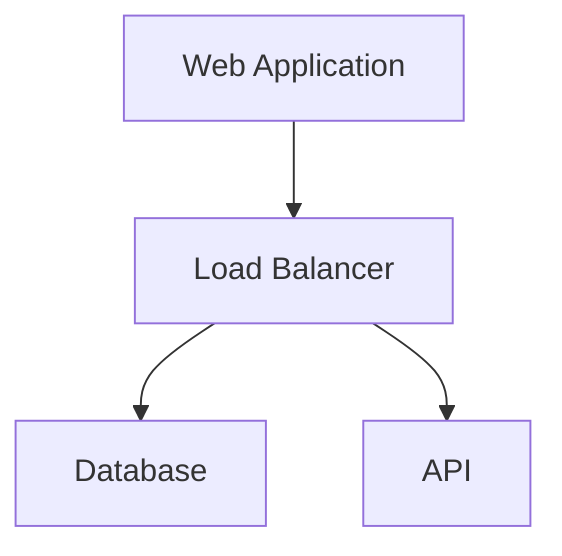

A sample post with markdown.

## Inline Highlighting

Sample of inline highlighting `sum = parseInt(num1) + parseInt(num2)`

# Markdown Features with Examples 🚀

Here are a ton of cool Markdown features and formatting that you can use to make your text more readable and visually appealing:

- **Bold text**: `**bold**` → **bold**
- _Italic text_: `*italic*` → _italic_
- `Code blocks`: `` `code` `` → `code`
- Lists: `- list item` →
  - list item
- [Links](https://www.example.com): `[Links](https://www.example.com)` → [Links](https://www.example.com)
- : `` → 
- Tables:

| Header 1 | Header 2 |
| -------- | -------- |
| Cell 1   | Cell 2   |

- ~~Strikethrough text~~: `~~strikethrough~~` → ~~strikethrough~~
- Superscript text: `H^2^O` → H2O
- Subscript text: `H~2~O` → H2O
- Emoji: `:smile:` → 😄

You can also use Markdown to create custom formatting, such as:

- > Blockquotes: `> Blockquotes` →
  > Blockquotes
- ## Horizontal rules: `---` or `***` →
- Definition lists:
  Term
  : Definition

- Ordered lists: `1. Ordered list item` →
  1. Ordered list item
- Unordered lists: `- Unordered list item` →
  - Unordered list item

Markdown is a powerful tool that can be used to create formatted text that is both readable and visually appealing. By learning the basics of Markdown, you can improve the readability of your text and make it more engaging for your readers.
