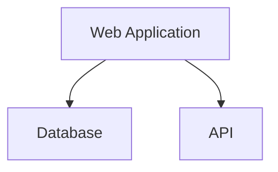
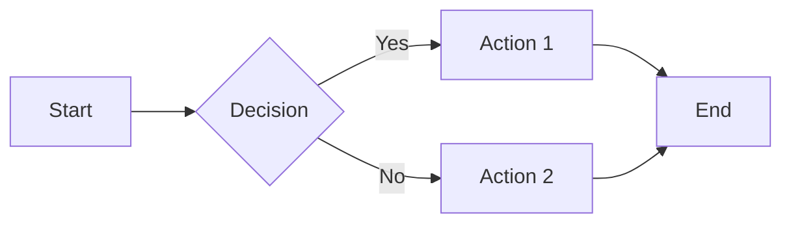
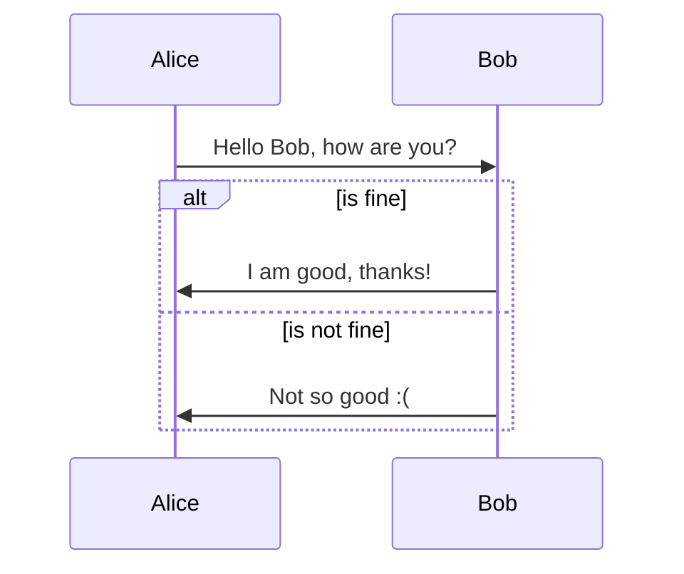
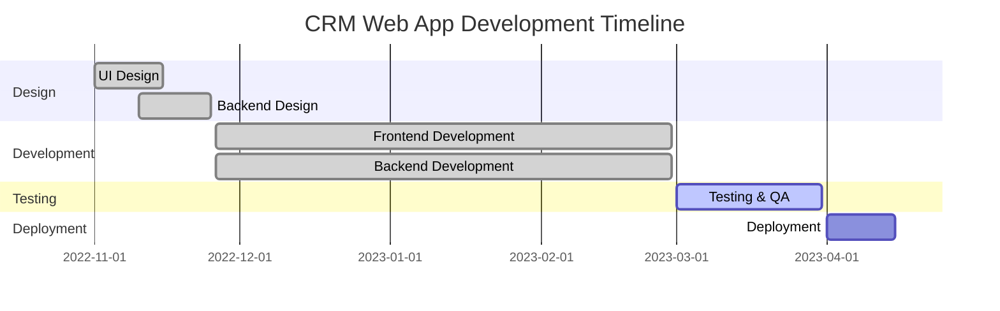
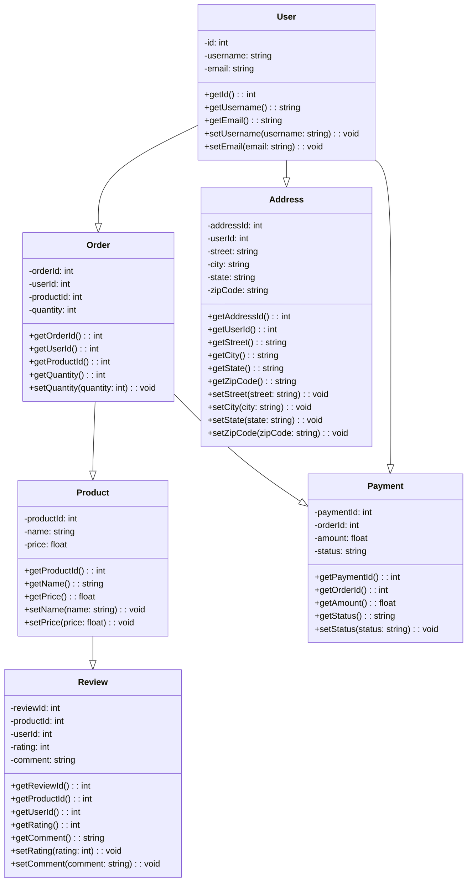

## Tutorial: Using ChatGPT and Mermaid to Create System Architecture Diagrams

## Introduction 📚

System architecture diagrams are a powerful tool for visualizing the components of a system and how they interact with each other. They can be used to communicate complex ideas to stakeholders, developers, and other technical teams.

Mermaid is a popular tool for creating system architecture diagrams. It is a lightweight markup language that can be used to create diagrams in a variety of formats, including HTML, SVG, and PNG.

ChatGPT is a large language model from Google AI, trained on a massive dataset of text and code. It can be used to generate text, translate languages, write different kinds of creative content, and answer your questions in an informative way. but did you know you can get it to make system architectures, You can feed in Data from your projects or Class diagrams and it will generate a system architecture diagram for you in mermaid markdown.

This can be usefull to collaborate with your team Present your work to stake holders or just to get a better understanding of your own project!

## Lets see Some examples

## Generate a diagram of a web application

### Here are some more complex examples

## Flowchart

## Sequence Diagram

## Gantt Chart

